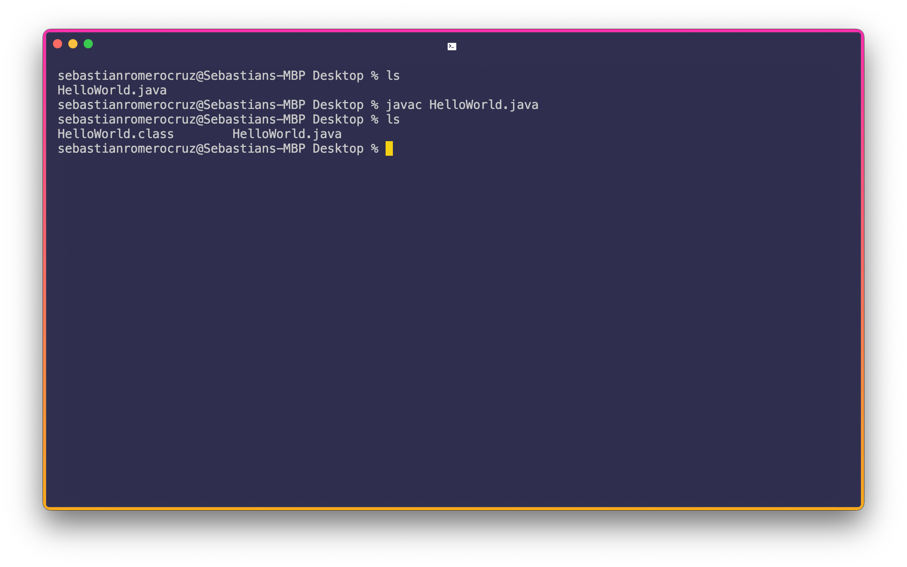
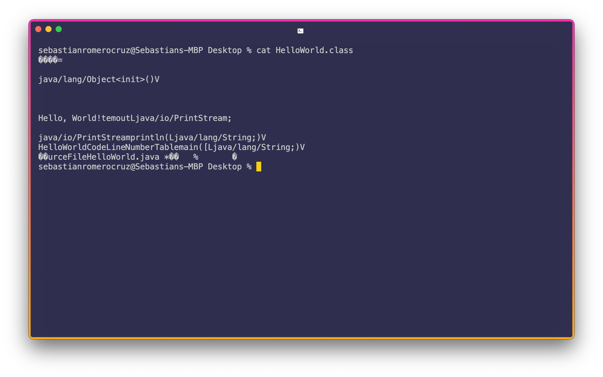
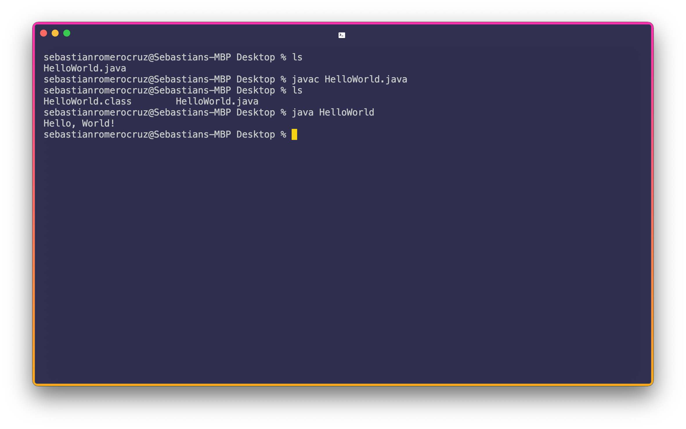
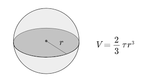

## Lecture 02

# Programming in Java and Java Development Kit (JDK)

***Song of the day***: _[**If You Know What's Right**](https://youtu.be/9CbtWVb8Omc) by Her's (2018)._

### Sections

1. [**Our First Java Program**](#part-1-_our-first-java-program_)
2. [**Compiling a Java File**](#part-2-_compiling-a-java-file_)
3. [**Running a Java File**](#part-3-_running-a-java-file_)
4. [**Demystifying Java**](#part-4-_demystifying-java_)
5. [**Our Second (and third, and fourth, and...) Java 
Program**](#part-5-_our-second-and-third-and-fourth-and-java-program_)

---

### Part 1: _Our First Java Program_

Before we get into the Java environment, let's just actually _write_ a quick program in Java for better context. Every
single Java program must exist within the confines of a **class**. By convention, we write class names using capitalised
camel-case (i.e. `LikeThis` and not `Like_This`):

```java
package helloWorld;  // For now, consider this the name of our current folder

class HelloWorld {
    // Our actual functionality will go here...
}
```

<sub>**Code Block 1**: The "skeleton" of a Java class. If you attempt to write code outside a Java class, the Java 
compiler will not let you run it (in fact, will not even bother trying to compile it).</sub>

Alright, so how to we tell Java to run things? If you want a Java class to execute something when it is compiled and 
ran, you need what is called a driver, or a **main**, function. Java's version of the `main()` is infamously verbose and
difficult to remember if you don't know what each individual part of it does, but we'll learn what each of these things
mean in due time:

```java
package helloWorld;

class HelloWorld {
    public static void main(String[] args) {
        // Our driver code will go here...
    }
}
```

<sub>**Code Block 2**: The Java `main()` function defined for the `HelloWorld` class.</sub>

The `public`, `static`, and `void` keywords will become massively important later on, but for now you don't have to 
worry about what they, nor what the `String[] args` mean. Let's just write a quick _"Hello, World!"_—the canonical 
first-line-of-code—inside the `main()` and tell Java to run it for now:

```java
package helloWorld;

class HelloWorld {
    public static void main(String[] args) {
        System.out.println("Hello, World!");
    }
}
```

<sub>**Code Block 3**: A [**Java _"Hello, World!"_**](HelloWorld.java) defined for the `HelloWorld` class.</sub>

If you've worked with other languages before, such as Python, `System.out.println()` is basically the equivalent of a
`print()` statement—it tells Java to display whatever is passed into the set of parentheses onto our screen. In this 
case, that whatever is the **string** of characters `"Hello, World!"` (strings of characters, or "strings" for short, 
are denoted in Java by quotation `"` marks).

### Part 2: _Compiling a Java file_

Cool, so how to we run this? Since Java is a _compiled_ language, we first need to break down our source code into 
something called "bytecode". This, essentially, is our code deconstructed in such a way that the _Java Virtual Machine_
(JVM) can interpret and tell your computer to run. The way we do this in our command line / Terminal is as follows:



<sub>**Figure 1**: A Terminal (the Unix equivalent of the Windows Command line) compiling our `HelloWorld.java` 
file.</sub>

In order, my terminal is doing the following:

1. Listing (`ls`) the files inside my Desktop folder.
2. **Compiling** our `HelloWorld.java` file by using the `javac` command.
3. Listing the files inside my Desktop folder once more. Notice that, post-compiling, there is a new file called 
`HelloWorld.class`. This is the file containing the aforementioned bytecode.

If we use the Terminal command `cat`, we can get a quick glimpse of the contents of this file:



<sub>**Figure 2**: The Terminal showing us the contents of `HelloWorld.class`. It's contents, intended for your computer
to interpret, are thus very difficult for _us_ to understand.</sub>

### Part 3: _Running a Java file_

Just compiling a Java file is not enough to actually run it—that's actually what our `.class` file is for. In order to
run it, we use the `java` command:



<sub>**Figure 3**: Running our `HelloWorld` program. Note that, when using the `java` command, we don't include the
`.class` extension.</sub>

There it is! Our Java file's output: a nice "Hello, World!". Congrats; you're a programmer now.

### Part 4: _Demystifying Java_

Java is sometimes (and infamously) referred to as a verbose language. This is a diplomatic way of saying that, until a
certain point, nobody has any idea of what half of what they are writing means (especially if they have never 
programmed before). Let's take our `HelloWorld` program from earlier and use the following table to make sense of it:

| **Character** | **Name**                            | **Description**                                              |
|---------------|-------------------------------------|--------------------------------------------------------------|
| **`{}`**      | Opening and closing braces          | Denote a block of enclosed statements (a.k.a. code)          |
| **`()`**      | Opening and closing parentheses     | Denotes the execution of a method (e.g. the `main()` method) |
| **`[]`**      | Opening and closing brackets        | Denotes an array. More on these in week 5                    |
| **`//`**      | Double slashes                      | Precede a comment line                                       |
| **`""`**      | Opening and closing quotation marks | Enclose a string (i.e. a sequence of characters)             |
| **`;`**       | Semicolon                           | Mark the end of a statement (i.e. a line of code)            |

<sub>**Figure 4**: Special characters in Java.</sub>

Line 1, for instance:

```java
package helloWorld;
```

Could be read in English as:

> This line of code consists of the `package` **keyword** and the package **name** `helloWorld`. We know that this line
> ends before of the semicolon `;` (also known as the **statement terminator**).

The proceeding lines:

```java
class HelloWorld {
    // Our actual functionality will go here...
}
```

Could be read as:

> The `class` keyword is being used to **define** a class with the **name** `HelloWorld`, whose functionality will be
> contained within the proceeding opening and closing brackets `{}`.

Our "print" statement:

```java
System.out.println("Hello, World!");
```

Could be read in English as:

> The `out.println()` **method**, which belongs to the `System` class, is being executed.

---

And so on and so forth. Not knowing how to "read" lines of code is not super important in the beginning (I much prefer
that you actually _write_ some code), but knowing the correct terminology certainly helps when listening to me talk, so
please don't hesitate in asking if you don't recognise any words!

### Part 5: _Our Second (and third, and fourth, and...) Java Program_

Let's practice what we have learned by writing a couple more Java classes. Let's write one that introduced ourselves.
I will call mine `Name`, but you can call it whatever you like:

```java
package helloWorld;

class Name {
    public static void main(String[] args) {
        System.out.println("Hello, my name is Sebastián.");
    }
}
```

<sub>**Code Block 4**: A Java [**program**](Name.java) introducing me. Welcome to the future.</sub>

Compiling the `Name.java` file and running the `Name.class` bytecode file will result in the following output:

```text
Hello, my name is Sebastián.
```

Nice. Let's try something involving things other than text. Let's write a program that prints the volume of the Earth, 
whose radius is approximately 6,371,000 metres. Recall, too, the formula for a sphere's volume:



<sub>**Figure 5**: The formula for the volume of a sphere. Here, the character τ (tau) is equivalent to 2π. I'm well 
aware that the Earth is actually an oblate spheroid, by the way. But I'm not doing that crap.</sub>

I will call this class `DisplayEarthVolume`:

```java
package helloWorld;

public class DisplayEarthVolume {
    public static void main(String[] args) {
        System.out.println((2.0 / 3.0) * 2 * 3.14156 * 6371000);
    }
}
```

<sub>**Code Block 5**: A Java [**program**](DisplayEarthVolume.java) to display the approximate volume of the 
Earth.</sub>

Compiling and running will result in the following output:

```text
2.6686505013333336E7
```

Note here the following:

- I preceded the `class` keyword with the `public` keyword. We'll learn about what this means later, but for the most
part, Java classes tend to be defined this way.
- Numbers in Java don't use `,` to, and can be defined with and without decimals (i.e. `2` vs `2.0`). We'll talk about
this more next week.
- The output, being quite large, was displayed in [**scientific 
notation**](https://en.wikipedia.org/wiki/Scientific_notation). `E` here is equivalent to saying "times ten to the power
of...".