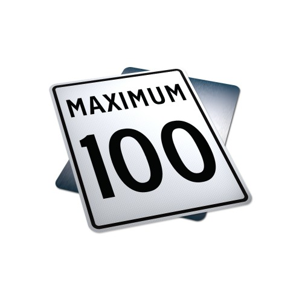

### Part 1: Review

#### The problem

One of the most obvious signs that you have entered another country once you cross the US border with Canada is the fact
that all speed limits are now posted using metric units; if you have been living in the United States for a while and
are used to cruising at, say, 60 miles—per—hour, suddenly seeing a speed limit sign with a huge `100` (without any
units written on it) can be pretty confusing.



<sub>**Figure 1**: Graphic design is their passion, apparently. [***Source***](https://albertasafetysign.com/) </sub>

Anyway, using all the conventions that we learned in class on Monday, write a public class that will convert 60
miles-per-hour from imperial units to metric units and print it out. Then, your program must repeat the process but in
reverse: convert 100 kilometres-per-hour from metric units to imperial. You may name this class, along with all its
variables and constants, however you feel appropriate.

These conversion factors may come in handy:
- **1 mile**: 1609.34 metres.
- **1 kilometre**: 0.621371 miles.

Recall that we learned naming and casing conventions for both variables and constants. Please apply them accordingly.

As a challenge, try to convert the acceleration of gravity (approximately 9.81 metres per second<sup>2</sup>) to miles
per hour-squared! (You can do this in the same class, if you'd like)

Sample output:

```text
60.0 miles per hour is equivalent to 96.5606698735538 kilometres per hour.
100.0 kilometres per hour is equivalent to 62.137100000000004 metres per hour.
```

Challenge sample output:

```text
9.81 metres per second-squared is equivalent to 78999.6176496 miles per hour-squared.
```